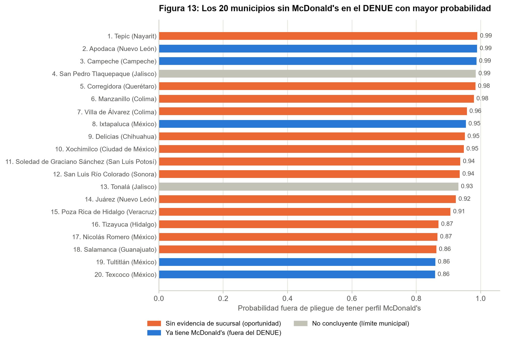
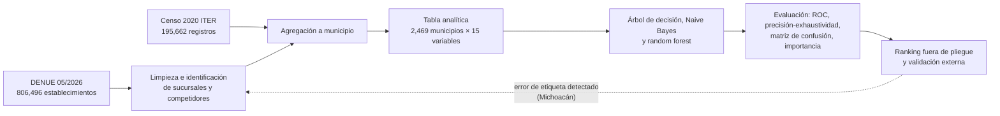
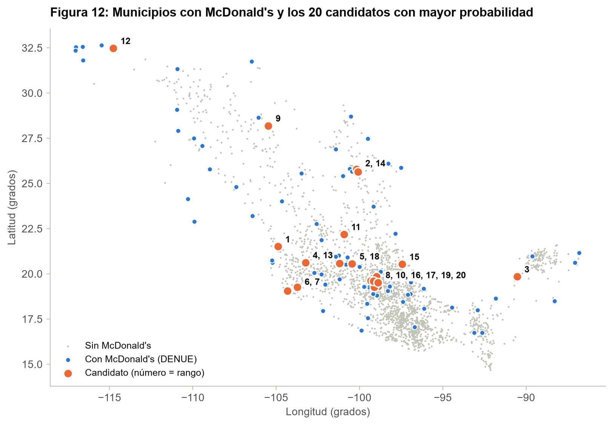
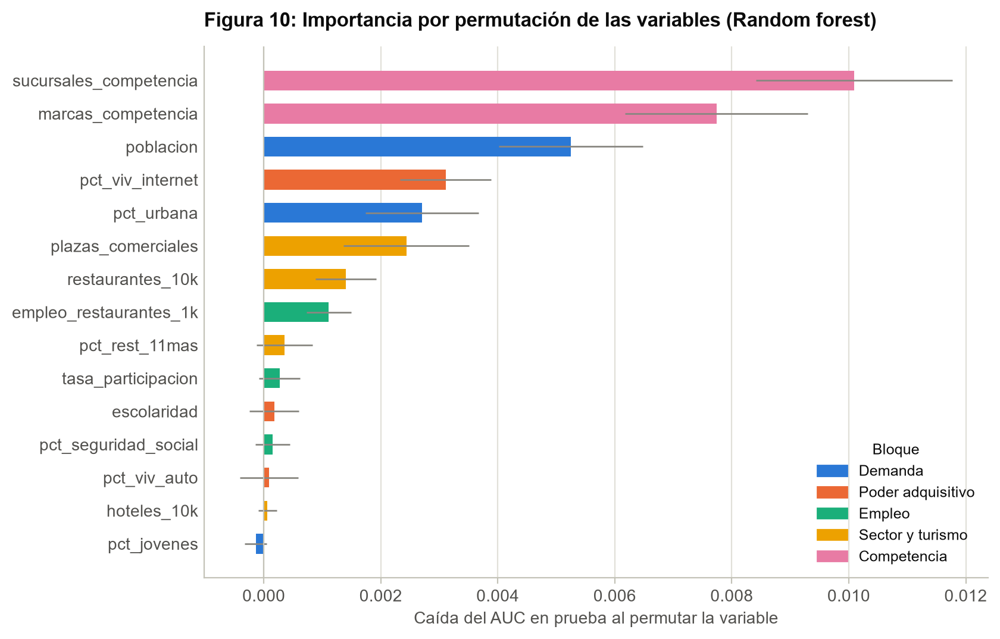

# ¿Dónde debe abrir McDonald's sus próximas sucursales en México?

## Proyecto final del Módulo IV – Minería de Datos

**Autor:** Diego Jiménez González
Diplomado en Técnicas Estadísticas y Minería de Datos · FES Acatlán, UNAM · Septiembre de 2026

El proyecto clasifica los 2,469 municipios de México con datos públicos de INEGI. El objetivo es encontrar
dónde existe un mercado con el mismo perfil que el de los municipios en los que McDonald's ya opera.

---

## Resumen ejecutivo

- **Contexto.** McDonald's opera más de 380 sucursales en México y busca acercarse a 400: necesita decidir
  dónde abrir alrededor de 20 más.
- **Identificación.** En el DENUE de mayo de 2026 se identificaron **417 sucursales en 123 municipios**.
  Entre ellas están las de un franquiciatario de Michoacán que registra sus restaurantes sin la marca.
- **Modelo.** Un **random forest** distingue a los municipios con McDonald's con un **AUC de 0.988** en el
  conjunto de prueba, y de 0.922 entre los 235 municipios de 100 mil habitantes o más.
- **Perfil.** Un municipio McDonald's tiene:
  - más de ~125 mil habitantes;
  - al menos tres cadenas rivales;
  - internet en más del 46 % de las viviendas;
  - un sector restaurantero con empleo formal.
- **Resultado.** De los 20 municipios con mayor probabilidad que no tienen sucursal en el DENUE:
  - **5 ya tienen un McDonald's** según el sitio oficial de la marca; Apodaca, por ejemplo, abrió en
    noviembre de 2025. El modelo reconoce los mercados donde la empresa ya está creciendo.
  - **13 son oportunidades depuradas**, encabezadas por **Tepic**.
  - **2 quedan como no concluyentes.**



---

## Pregunta de negocio e hipótesis

**Pregunta.** ¿En qué municipios que hoy no tienen un McDonald's existe un mercado con el mismo perfil que los
municipios donde la marca ya opera?

**Hipótesis (H1).** La presencia de McDonald's se explica por cinco factores medibles:

1. demanda;
2. poder adquisitivo;
3. empleo;
4. sector restaurantero y turismo;
5. competencia.

**Criterios de decisión, fijados antes de modelar:**

| Criterio | Umbral | Resultado |
|---|---|---|
| AUC del mejor modelo en prueba | ≥ 0.80 | 0.988 |
| Demanda y poder adquisitivo entre las variables más importantes | Entre las primeras | Población, internet y urbanización en los lugares 3 a 5, detrás de la competencia |
| Diferencias significativas entre municipios con y sin McDonald's | Mayoría | 15 de 15 variables (Mann-Whitney, p < 0.05) |

**H1 se sostiene.**

---

## Datos

Todos los datos son públicos, de INEGI, y se usan bajo los
[Términos de Libre Uso de la Información del INEGI](https://www.inegi.org.mx/inegi/terminos.html).

| Fuente | Edición | Archivo en `datos/crudos/` | Uso |
|---|---|---|---|
| DENUE, sector 72 (alojamiento y preparación de alimentos) | 05/2026 | `denue_00_72_1_csv.zip`, `denue_00_72_2_csv.zip` | Sucursales de McDonald's, 8 cadenas rivales, restaurantes, hoteles y plazas comerciales |
| Censo de Población y Vivienda 2020, ITER | 2020 (versión de 2022) | `iter_00_cpv2020_csv.zip` | Población, escolaridad, vivienda y empleo por municipio |

El detalle de cada archivo (URL, huella SHA-256 y columnas) está en [`datos/README.md`](datos/README.md). El
diccionario de la tabla analítica, con la clasificación NOIR de cada variable, está en
[`datos/diccionario_datos.csv`](datos/diccionario_datos.csv).

---

## Metodología

El notebook sigue la estructura de la especificación del proyecto y el ciclo CRISP-DM:



| Requerimiento de la especificación | Sección del notebook |
|---|---|
| Análisis del negocio: pregunta (hipótesis), escenario y variables de negocio | 1.1 – 1.3 |
| Datos origen (diccionario) | 2.1 |
| Proceso ETL | 2.2 |
| Limpieza y transformación de datos | 2.3 (bitácora de 9 pasos por dimensión de calidad) |
| Análisis de datos (estadística descriptiva) | 2.4 |
| Algoritmo a aplicar | 3.1 |
| Parámetros de configuración | 3.2 (búsqueda en rejilla con validación cruzada de 5 pliegues) |
| Datos de entrenamiento | 3.3 (70 %, estratificado) |
| Datos de prueba | 3.4 (30 %, reservado) |
| Resultados del modelo y evaluación | 3.5 |
| Consideraciones: beneficios, limitaciones y supuestos | 4 |
| Conclusiones y recomendaciones | 5 |

---

## Resultados

**Desempeño en el conjunto de prueba (741 municipios, 37 con McDonald's)**

| Modelo | AUC ROC | Precisión promedio | Precisión | Exhaustividad | F1 |
|---|---|---|---|---|---|
| Árbol de decisión (explicativo) | 0.924 | 0.719 | 0.604 | 0.865 | 0.711 |
| Naive Bayes gaussiano (línea base) | 0.986 | 0.826 | 0.589 | 0.892 | 0.710 |
| **Random forest (puntuación)** | **0.988** | **0.840** | **0.705** | **0.838** | **0.765** |

**Oportunidades depuradas.** Son los candidatos del top 20 sin evidencia de sucursal en el sitio oficial de
la marca (consulta del 19 de septiembre de 2026).

| Rango | Municipio | Entidad | Probabilidad | Tipo | Población 2020 |
|---|---|---|---|---|---|
| 1 | Tepic | Nayarit | 0.99 | Mercado nuevo | 425,924 |
| 5 | Corregidora | Querétaro | 0.98 | Densificación | 212,567 |
| 6 | Manzanillo | Colima | 0.98 | Mercado nuevo | 191,031 |
| 7 | Villa de Álvarez | Colima | 0.96 | Densificación* | 149,762 |
| 9 | Delicias | Chihuahua | 0.95 | Mercado nuevo | 150,506 |
| 10 | Xochimilco | Ciudad de México | 0.95 | Densificación | 442,178 |
| 11 | Soledad de Graciano Sánchez | San Luis Potosí | 0.94 | Densificación | 332,072 |
| 12 | San Luis Río Colorado | Sonora | 0.94 | Mercado nuevo | 199,021 |
| 14 | Juárez | Nuevo León | 0.92 | Densificación | 471,523 |
| 15 | Poza Rica de Hidalgo | Veracruz | 0.91 | Mercado nuevo | 189,457 |
| 16 | Tizayuca | Hidalgo | 0.87 | Densificación | 168,302 |
| 17 | Nicolás Romero | México | 0.87 | Densificación | 430,601 |
| 18 | Salamanca | Guanajuato | 0.86 | Densificación | 273,417 |

\* La sucursal de referencia de Villa de Álvarez, en la ciudad de Colima, cerró en mayo de 2025. Es la única
sucursal del estado que registra el DENUE, así que Manzanillo y Villa de Álvarez deben evaluarse con cautela.





---

## Estructura del repositorio

```
.
├── README.md
├── proyecto_expansion_mcdonalds.ipynb   # Entregable principal, ejecutado
├── requirements.txt
├── datos/
│   ├── README.md                        # Fuentes, huellas SHA-256 y descripción de cada archivo
│   ├── diccionario_datos.csv            # Diccionario de la tabla analítica (nivel NOIR incluido)
│   ├── crudos/                          # ZIP originales de INEGI, sin modificar
│   ├── procesados/                      # Resultados intermedios del ETL
│   └── analiticos/                      # Tabla del modelo, predicciones y validación externa
├── figuras/                             # Las 13 figuras del notebook, una por archivo
├── presentacion/
│   ├── guion.md                         # Guion de la exposición (1–2 minutos)
│   └── presentacion_ejecutiva.pptx      # 5 diapositivas
└── docs/
    └── Proyecto specs.pdf               # Especificación del proyecto
```

---

## Cómo reproducir

Requisitos: Python 3.13 y las bibliotecas de `requirements.txt`.

```bash
python -m pip install -r requirements.txt
jupyter notebook proyecto_expansion_mcdonalds.ipynb   # Ejecutar todas las celdas
```

El notebook:

- lee los ZIP directamente de `datos/crudos/`, sin descomprimirlos;
- descarga de INEGI los que falten y verifica su huella SHA-256;
- regenera `datos/procesados/`, `datos/analiticos/` y `figuras/`.

La ejecución completa tarda alrededor de un minuto. Todos los procesos aleatorios usan la semilla 42.

---

## Limitaciones principales

- **La etiqueta refleja las decisiones pasadas de la empresa, no la rentabilidad.** Un municipio sin
  sucursal pudo descartarse por seguridad, predios o logística.
- **El DENUE tiene rezago.** Omite aperturas recientes y conserva algunos cierres; por eso el top 20 se
  validó contra el sitio oficial de la marca.
- **La unidad municipal es gruesa.** El siguiente paso es bajar a AGEB urbana para ubicar plazas y avenidas
  concretas.
- **La competencia es endógena.** Sirve para predecir, no como causa.

El detalle está en la sección 4 del notebook.

---

## Referencias

- INEGI (2026). *Directorio Estadístico Nacional de Unidades Económicas (DENUE) 05/2026*.
  https://www.inegi.org.mx/app/descarga/?ti=6
- INEGI (2021, actualizado en 2022). *Censo de Población y Vivienda 2020. Principales resultados por localidad
  (ITER)*. https://www.inegi.org.mx/programas/ccpv/2020/
- Expansión (14 de agosto de 2026). *McDonald's ya tiene 380 sucursales en México y quiere abrir más.*
  https://expansion.mx/empresas/2026/08/14/mcdonalds-380-sucursales-abrir-mas-mexico
- ABC Noticias (25 de noviembre de 2025). *McDonald's inaugura su primera sucursal en Apodaca.*
  https://abcnoticias.mx/local/2025/11/25/mcdonalds-inaugura-su-primera-sucursal-en-apodaca-266740.html
- McDonald's México. Localizador de restaurantes. https://www.mcdonalds.com.mx/restaurantes
